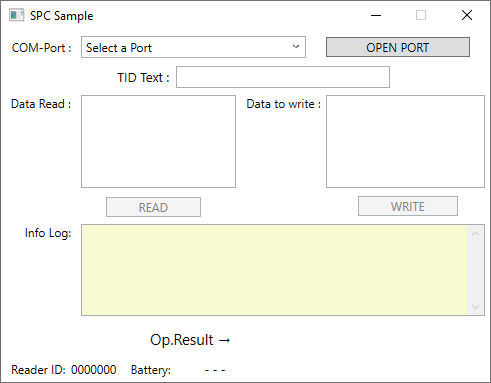

# .NET SPC sample code
This sample uses serial communication to communicate with device in SPC mode
> For details on SPC communication check [Useful Links](#Useful-Links)

## Requirements
* IDE (for example Visual Studio)
* Micro-Sensys RFID reader with appropriate script running
* RFID transponders

> For compatible script files, check [Useful Links](#Useful-Links)

## Implementation
This code shows how to use **iIDReaderLibrary.SpcInterfaceControl** class to communicate with a device running on SPC mode. 
For demo purposes both a .NET Core console and a WPF App as sample code are provided.
Code used for these projects is written in C# or VisualBasic

## Steps
Import the project into your, chose a project and launch it. Fist check the communication port name for the RFID reader (for example *COM3*) and if needed fill the name into the code.
For some samples the available devices are automatically detected. 

 1. Select the device you wish to connect to, and press OPEN PORT. Once the connect process finishes, the result will be shown in the EditText on the bottom side, and if the device is connected, the READ/WRITE buttons will be enabled.
 2. Received data will be automatically decoded as Heartbeat or other data
 3. Use READ/WRITE buttons to trigger the processes built in the script

## Useful Links

* [Scripts](https://www.microsensys.de/downloads/DevSamples/Sample%20Codes/SPC/Additionals/Sample%20scripts/)
* [iID® INTERFACE configuration tool (tool to upload script to reader)](https://www.microsensys.de/downloads/CDContent/Install/iID%c2%ae%20interface%20config%20tool.zip)
* GitHub *documentation* repository: [Micro-Sensys/documentation](https://github.com/Micro-Sensys/documentation)
	* [communication-modes/spc](https://github.com/Micro-Sensys/documentation/tree/master/communication-modes/spc)

## Contact

* For coding questions or questions about this sample code, you can use [support@microsensys.de](mailto:support@microsensys.de)
* For general questions about the company or our devices, you can contact us using [info@microsensys.de](mailto:info@microsensys.de)

## Authors

* **Victor Garcia** - *Initial work* - [MICS-VGarcia](https://github.com/MICS-VGarcia/)
