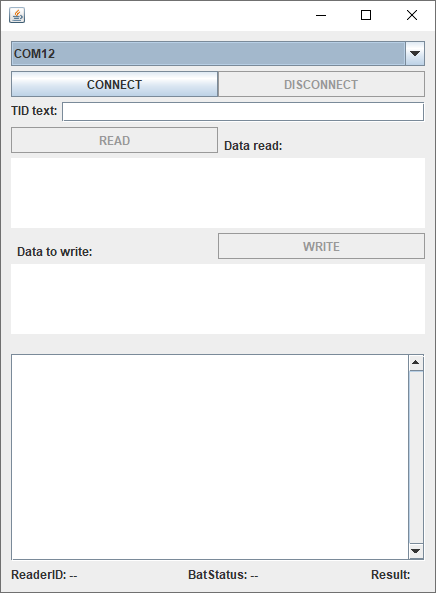

# SPC sample for Java
This code shows how to use **SpcInterfaceControl** class to communicate with a device running on SPC mode. 

## Requirements
* Java IDE (For implementing this sample *eclipse IDE* was used)
* Micro-Sensys RFID reader with appropriate script running
* RFID transponders

> For compatible script files, check [Useful Links](#Useful-Links)

## Implementation
This code shows how to use **SpcInterfaceControl** class to communicate with a device running on SPC mode. 
Using this class the communication port can be open/closed. It automatically handles the data received and notifies the App using a Callback, and provides a function to send trigger commands to the script.

> Class information is available under API documentation. See [Useful Links](#Useful-Links)

## Steps
Import this project into your IDE and check the communication port name for the RFID reader (for example *COM12*) and fill the name into the *JComboBox*.
Once the name is added to the code, start the debug/run session.

 1. Select the device you wish to connect to, and press CONNECT. Once the connect process finishes, the result will be shown in the EditText on the bottom side, and if the device is connected, the READ/WRITE buttons will be enabled.
 2. Received data will be automatically received on provided **SpcInterfaceCallback**
	"spcReaderHeartbeatReceived" will be called when Heartbeat is received
	"spcRawDataReceived" will be called when other data is received
 3. Use READ/WRITE buttons to trigger the processes built in the script

## Useful Links
* [JAR Library and API documentation](https://www.microsensys.de/downloads/DevSamples/Libraries/Windows/microsensysRFID%20-%20jar%20library/)
* [Scripts](https://www.microsensys.de/downloads/DevSamples/Sample%20Codes/SPC/Additionals/Sample%20scripts/)
* [iID® INTERFACE configuration tool (tool to upload script to reader)](https://www.microsensys.de/downloads/CDContent/Install/iID%c2%ae%20interface%20config%20tool.zip)
* GitHub *documentation* repository: [Micro-Sensys/documentation](https://github.com/Micro-Sensys/documentation)
	* [communication-modes/spc](https://github.com/Micro-Sensys/documentation/tree/master/communication-modes/spc)

## Contact
* For coding questions or questions about this sample code, you can use [support@microsensys.de](mailto:support@microsensys.de)
* For general questions about the company or our devices, you can contact us using [info@microsensys.de](mailto:info@microsensys.de)

## Authors

* **Victor Garcia** - *Initial work* - [MICS-VGarcia](https://github.com/MICS-VGarcia/)
